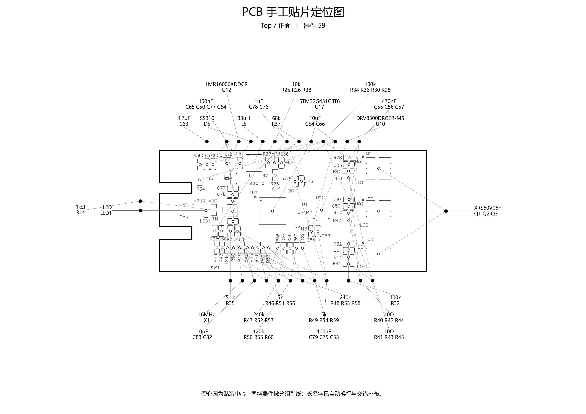
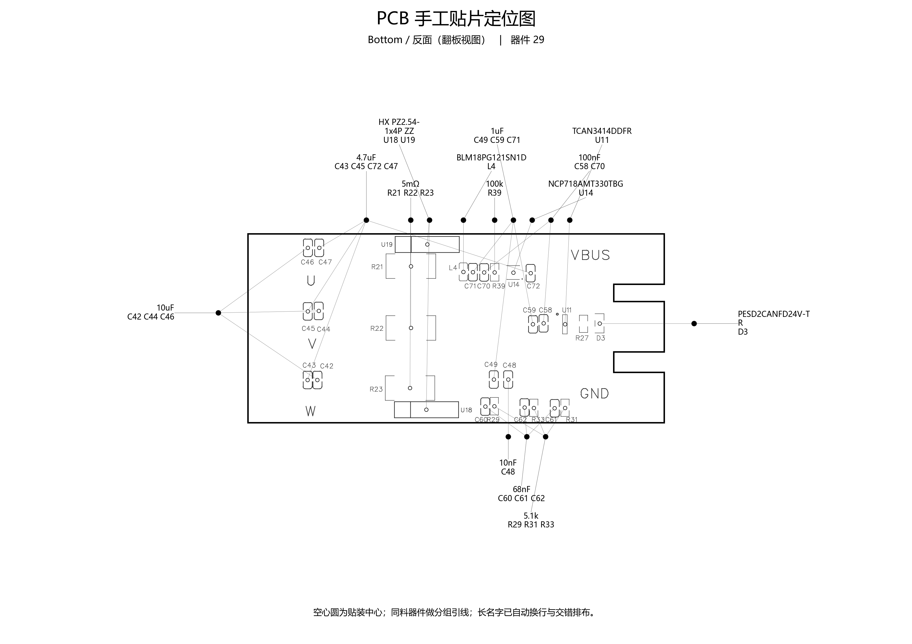
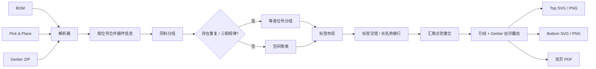

# PCB-HandPlace-Map

<p align="center">
  <b>PCB Hand Placement Map Generator</b><br>
  从 BOM、Pick & Place 和 Gerber 自动生成适合打印的 PCB 手工贴片定位图
</p>

<p align="center">
  
  
  
  
</p>

---

## 1. 项目简介

在钢网上锡之后进行手工贴片时，真正耗时间的往往不是“把元件放上去”，而是：

> **拿到一种阻值 / 容值 / 型号以后，在密集 PCB 上快速找到这一批器件到底在哪里。**

传统方式通常需要：

- 在电脑上打开 PCB 文件；
- 根据 BOM 查询位号；
- 在丝印层中一个个搜索；
- 在 PCB、BOM 和实物料盘之间不断切换；
- 没有电脑时只能在打印图上人工寻找。

`PCB-HandPlace-Map` 用来解决这个问题。

程序将：

```text
BOM
+
Pick & Place
+
Gerber
```

自动合并，生成一套适合手工贴片的定位图。

最终可以直接打印：

- **Top / 正面定位图**
- **Bottom / 反面定位图**
- **双页 PDF**
- **SVG 矢量图**
- **PNG 预览图**

相同参数 / 型号的器件会自动组成小组，通过细线连接到板外标签。

---

# 2. 实际效果

下面的图片由本仓库脚本直接使用真实：

- BOM
- Pick & Place
- Gerber

生成。

## Top / 正面

<p align="center">
  
</p>

## Bottom / 反面

<p align="center">
  
</p>

### 图中符号含义

| 图形 | 含义 |
|---|---|
| PCB 黑色粗线 | Board Outline / 板框 |
| PCB 内部灰黑线 | Gerber Silkscreen / 丝印 |
| 空心圆 | Pick & Place 中的器件贴装中心 |
| 板外黑点 | 一组相同器件的汇聚节点 |
| 细引线 | 从器件位置连接到对应参数 / 型号 |
| 标签第一部分 | 参数 / 型号 |
| 标签第二部分 | 对应位号 |

例如：

```text
5k
R46 R51 R56
```

表示这一组器件：

```text
R46
R51
R56
```

均使用：

```text
5k
```

---

# 3. 为什么不是简单把所有同值器件连在一起？

如果一个三相电机驱动板存在：

```text
R46 R51 R56 = 5k
R49 R54 R59 = 5k
```

虽然六颗电阻参数都相同，但直接生成：

```text
R46 R49 R51 R54 R56 R59 -> 5k
```

会让贴片图非常混乱。

本工具会优先识别重复电路 / 三相电路中的**等差位号模式**，生成：

```text
R46 R51 R56 -> 5k

R49 R54 R59 -> 5k
```

从而更接近真实电路结构。

如果找不到明显的重复位号规律，则退回到：

> **空间邻近聚类**

保证同一种料不会全部堆到一个巨大的标签中。

---

# 4. 主要功能

目前支持：

- [x] BOM 自动解析
- [x] Pick & Place 自动解析
- [x] Gerber Board Outline 解析
- [x] Gerber Top Silkscreen 解析
- [x] Gerber Bottom Silkscreen 解析
- [x] Top / Bottom 分页
- [x] Bottom 翻板视图
- [x] 自动识别多个 Excel Sheet
- [x] 自动寻找真实表头所在行
- [x] 模糊匹配相近表头名称
- [x] 支持不同 Excel / CSV 导出格式
- [x] 支持电阻、电容、MOS、IC、电感、二极管、连接器等全部器件
- [x] 相同“分类 + 参数/型号”自动分组
- [x] 三相 / 重复电路优先分组
- [x] 空间聚类兜底
- [x] 长型号自动换行
- [x] 标签上下交错
- [x] 左右标签分列
- [x] 汇聚黑点自动拉开
- [x] 引线位于最高图层，避免被文字遮挡
- [x] DNP 默认过滤
- [x] PDF 输出
- [x] SVG 矢量输出
- [x] PNG 高分辨率预览输出
- [x] 自动输出解析报告

---

# 5. 工作流程



---

# 6. 环境要求

## Python

推荐：

```text
Python 3.9+
```

Python 3.10 / 3.11 / 3.12 / 3.13 通常也可以运行。

检查版本：

```bash
python --version
```

例如：

```text
Python 3.12.4
```

---

# 7. 所需 Python 库

核心依赖只有：

```text
matplotlib
```

安装：

```bash
pip install matplotlib
```

或者：

```bash
python -m pip install matplotlib
```

推荐直接使用仓库中的：

```bash
pip install -r requirements.txt
```

当前：

```text
requirements.txt
```

主要包含：

```text
matplotlib>=3.7
```

---

## 旧版 `.xls` 文件

如果输入的是 Excel 97-2003 的：

```text
.xls
```

还需要：

```bash
pip install xlrd>=2.0
```

`.xlsx / .xlsm / .csv / .tsv` 不需要 `xlrd`。

---

# 8. 支持的表格格式

BOM 和 Pick & Place 支持：

```text
.xlsx
.xlsm
.xltx
.csv
.tsv
.txt
.xls
```

其中：

| 格式 | 支持情况 | 额外依赖 |
|---|---:|---|
| `.xlsx` | ✅ | 无 |
| `.xlsm` | ✅ | 无 |
| `.xltx` | ✅ | 无 |
| `.csv` | ✅ | 无 |
| `.tsv` | ✅ | 无 |
| `.txt` | ✅ | 无 |
| `.xls` | ✅ | `xlrd>=2.0` |

---

# 9. Excel 不需要完全固定模板

这是项目的重要设计目标之一。

程序**不要求 BOM 和 Pick & Place 必须使用完全相同的 Excel 模板**。

只要核心表头大致相近，程序会自动尝试识别。

程序会：

1. 读取所有工作表；
2. 在多个 Sheet 中寻找最像 BOM / Pick & Place 的 Sheet；
3. 扫描前 30 行；
4. 自动判断真正的表头行；
5. 忽略表头前面的标题、说明和空行；
6. 对常见中英文表头做模糊匹配。

---

# 10. BOM 表头要求

## 必需信息

BOM 至少需要：

- 位号
- 参数 / 型号

推荐再提供：

- 分类
- 封装
- 装配状态
- 备注

---

## 位号列支持

以下名称都可以尝试识别：

```text
位号
Designator
Designators
Reference
Reference Designator
RefDes
Ref
Refs
```

---

## 参数 / 型号列支持

例如：

```text
参数/型号
参数
型号
Value
Comment
Part
Part Number
PartNumber
MPN
Description
Component
Name
```

---

## 分类列支持

例如：

```text
分类
Category
类型
Type
Class
Component Type
器件类型
```

### 没有分类列怎么办？

可以。

如果 BOM 没有分类列，程序会尝试根据位号前缀推断。

例如：

| 位号 | 推断 |
|---|---|
| `Rxx` | 电阻 |
| `Cxx` | 电容 |
| `Lxx` | 电感 |
| `Dxx` | 二极管 |
| `Qxx` | MOSFET / 晶体管 |
| `Uxx` | IC |
| `Jxx / Pxx` | 连接器 |
| `Xxx / Yxx` | 晶振 |

---

# 11. Pick & Place 表头要求

必须包含：

- 位号
- X
- Y
- Layer / Side

推荐包含：

- Rotation
- Footprint
- Comment
- SMD

---

## X 坐标支持

例如：

```text
Mid X
Center X
Centre X
Position X
Pos X
X
X(mm)
坐标X
中心X
X Position
```

## Y 坐标支持

例如：

```text
Mid Y
Center Y
Centre Y
Position Y
Pos Y
Y
Y(mm)
坐标Y
中心Y
Y Position
```

---

# 12. 坐标单位

默认认为无单位数字为：

```text
mm
```

以下格式也可以解析：

```text
12.35
12.35mm
12.35 mm
```

程序还提供基础的：

```text
mil
inch
```

转换支持。

---

# 13. PCB Layer / Side 识别

以下内容都可以被映射到 Top：

```text
Top
TopLayer
Front
T
F
正面
顶层
```

以下内容都可以被映射到 Bottom：

```text
Bottom
BottomLayer
Back
B
反面
底层
```

---

# 14. Gerber 输入要求

Gerber 建议压缩成一个：

```text
Gerber.zip
```

至少需要：

```text
Board Outline
Top Silkscreen
Bottom Silkscreen
```

---

## 常见 EasyEDA / 嘉立创文件名

例如：

```text
Gerber_BoardOutlineLayer.GKO
Gerber_TopSilkscreenLayer.GTO
Gerber_BottomSilkscreenLayer.GBO
```

---

## 其他常见形式

程序也会尝试识别类似：

```text
BoardOutline.GKO
TopSilkscreen.GTO
BottomSilkscreen.GBO
Edge_Cuts.gbr
```

---

## 注意

当前项目中的 Gerber 解析器是一个：

> **面向贴片定位图的轻量级 RS-274X 解析器**

它不是完整的 CAM / Gerber Viewer。

目标是提取：

- 板框
- 丝印
- 基本线段
- 基本圆弧

然后用于生成打印定位图。

对于特别复杂或特殊格式的 Gerber，可能需要增加对应解析规则。

---

# 15. 安装

## 方法 1：直接下载仓库

下载 ZIP 后解压：

```text
PCB-HandPlace-Map/
```

进入目录。

---

## 方法 2：Git Clone

```bash
git clone https://github.com/YOUR_NAME/PCB-HandPlace-Map.git
cd PCB-HandPlace-Map
```

将：

```text
YOUR_NAME
```

替换成自己的 GitHub 用户名。

---

# 16. 安装依赖

```bash
pip install -r requirements.txt
```

如果你使用 Conda：

```bash
conda activate your_env
pip install -r requirements.txt
```

例如当前命令提示符可能类似：

```text
(yolov26) F:\file\BaiduSyncdisk\Project\PCB_assembly_map>
```

只要这个 Python 环境中已经安装 `matplotlib` 就可以运行。

---

# 17. 最简单的使用方式

假设目录：

```text
PCB_assembly_map/
├── BOM_Board1_Schematic1_2026-08-18.xlsx
├── Gerber_PCB1.zip
├── PickAndPlace_PCB1_2026-08-26.xlsx
└── pcb_assembly_map.py
```

直接执行：

```bash
python pcb_assembly_map.py --bom "BOM_Board1_Schematic1_2026-08-18.xlsx" --pnp "PickAndPlace_PCB1_2026-08-26.xlsx" --gerber "Gerber_PCB1.zip" --out "贴片定位图"
```

---

# 18. Windows 使用示例

## CMD / PowerShell：推荐直接使用单行命令

```bash
python pcb_assembly_map.py --bom "BOM_Board1_Schematic1_2026-08-18.xlsx" --pnp "PickAndPlace_PCB1_2026-08-26.xlsx" --gerber "Gerber_PCB1.zip" --out "贴片定位图"
```

运行时会看到：

```text
[1/5] 读取 BOM ...
    BOM工作表: 最终BOM，表头第 1 行

[2/5] 读取 Pick&Place ...
    PnP工作表: PickAndPlace_PCB1_2026-08-26，表头第 1 行

[3/5] 合并 BOM + 坐标 ...

[4/5] 解析 Gerber ...

[5/5] 生成双页图 ...

完成。
```

---

# 19. Linux / macOS

```bash
python3 pcb_assembly_map.py \
  --bom "BOM.xlsx" \
  --pnp "PickAndPlace.xlsx" \
  --gerber "Gerber.zip" \
  --out "output"
```

---

# 20. 查看帮助

```bash
python pcb_assembly_map.py --help
```

当前主要参数：

```text
--bom
--pnp
--gerber
--out
--include-dnp
--no-bottom-mirror
--phase-size
--max-spatial-group
```

---

# 21. 参数说明

| 参数 | 必需 | 默认值 | 说明 |
|---|---:|---|---|
| `--bom` | ✅ | - | BOM 文件 |
| `--pnp` | ✅ | - | Pick & Place 文件 |
| `--gerber` | ✅ | - | Gerber ZIP |
| `--out` | ❌ | `output` | 输出目录 |
| `--include-dnp` | ❌ | 关闭 | 是否绘制 DNP |
| `--no-bottom-mirror` | ❌ | 关闭 | Bottom 是否取消翻板镜像 |
| `--phase-size` | ❌ | `3` | 重复 / 多相电路优先分组数量 |
| `--max-spatial-group` | ❌ | `4` | 空间聚类每组最大器件数 |

---

# 22. 输出文件

按照示例命令运行以后：

```text
PCB_assembly_map/
├── BOM_Board1_Schematic1_2026-08-18.xlsx
├── Gerber_PCB1.zip
├── PickAndPlace_PCB1_2026-08-26.xlsx
├── pcb_assembly_map.py
└── 贴片定位图/
    ├── PCB_双页手工贴片定位图.pdf
    ├── PCB_贴片定位图_Top.png
    ├── PCB_贴片定位图_Top.svg
    ├── PCB_贴片定位图_Bottom.png
    ├── PCB_贴片定位图_Bottom.svg
    ├── PCB_贴片定位图_SVG编辑器.html
    └── 生成报告.txt
```

---

# 23. SVG 原图编辑器 —— 推荐用于最后人工整理

程序现在只生成**一个编辑器**：

```text
PCB_贴片定位图_SVG编辑器.html
```

这个编辑器和旧版最大的区别是：

> **它不会重新绘制 PCB。它直接读取 Python 已经生成的 Top / Bottom SVG 本体进行编辑。**

因此浏览器里看到的画面就是：

```text
PCB_贴片定位图_Top.svg
```

或：

```text
PCB_贴片定位图_Bottom.svg
```

本身，不会出现 HTML 预览和 PNG / SVG / PDF 长得不一样的问题。

---

## 推荐使用 Chrome / Edge

为了允许网页在你确认授权以后直接覆盖输出目录中的文件，推荐使用：

```text
Google Chrome
Microsoft Edge
```

Firefox / Safari 仍可以加载和下载 SVG，但“直接写回原文件夹”的能力取决于浏览器对 File System Access API 的支持。

---

## 最推荐的使用流程

先运行 Python：

```bash
python pcb_assembly_map.py --bom "BOM_Board1_Schematic1_2026-08-18.xlsx" --pnp "PickAndPlace_PCB1_2026-08-26.xlsx" --gerber "Gerber_PCB1.zip" --out "贴片定位图"
```

得到：

```text
贴片定位图/
├── PCB_双页手工贴片定位图.pdf
├── PCB_贴片定位图_Top.png
├── PCB_贴片定位图_Top.svg
├── PCB_贴片定位图_Bottom.png
├── PCB_贴片定位图_Bottom.svg
├── PCB_贴片定位图_SVG编辑器.html
└── 生成报告.txt
```

然后双击：

```text
PCB_贴片定位图_SVG编辑器.html
```

---

## 方法 A：直接打开整个输出文件夹

点击：

```text
打开“贴片定位图”文件夹
```

选择刚才生成的：

```text
贴片定位图/
```

编辑器会自动寻找并加载：

```text
PCB_贴片定位图_Top.svg
PCB_贴片定位图_Bottom.svg
```

这是最推荐的方法。

优点是编辑完成后，可以点击：

```text
写回全部 SVG / PNG / PDF
```

直接覆盖同一文件夹中的最终结果。

浏览器会先要求你授权目录写入权限，不会静默修改其他文件。

---

## 方法 B：手动加载 SVG

如果浏览器不支持文件夹访问，可以点击：

```text
加载 SVG
```

一次选择：

```text
PCB_贴片定位图_Top.svg
PCB_贴片定位图_Bottom.svg
```

编辑器会根据文件名自动判断 Top / Bottom。

这种模式编辑没有问题，但最终通常通过：

```text
下载当前 SVG
下载全部
```

保存结果。

---

## 可以拖动什么？

### 1. 直接拖动参数 / 位号标签

例如：

```text
240k
R47 R52 R57
```

鼠标直接拖走即可。

因为编辑的是**原 SVG 中的标签对象**，PCB 丝印、板框、元件位置都保持原样。

连接到标签的引线会跟随移动。

### 2. 拖动黑色汇聚点

板边黑色汇聚点也可以直接拖动。

拖动以后：

```text
器件位置 → 黑点 → 参数标签
```

相关引线都会实时更新。

### 3. 方向键精细调整

鼠标点击一个标签或黑点后，可以使用：

```text
←  →  ↑  ↓
```

做细微移动。

更大步长使用：

```text
Shift + 方向键
```

适合最后打印前做毫米级微调。

### 4. 撤销

可以点击：

```text
撤销
```

也可以：

```text
Ctrl + Z
```

---

## Top / Bottom 切换

一个 HTML 同时管理两张 SVG。

使用顶部：

```text
Top
Bottom
```

切换即可。

不再分别生成两个 HTML 文件。

---

## 缩放

编辑器顶部提供：

```text
－   100%   ＋
```

只改变浏览器中的查看比例，不会修改最终 SVG 页面尺寸。

---

## 一键写回最终文件

如果通过：

```text
打开“贴片定位图”文件夹
```

载入，并且浏览器支持文件夹写入，那么编辑完成以后点击：

```text
写回全部 SVG / PNG / PDF
```

编辑器会重新生成并覆盖：

```text
PCB_贴片定位图_Top.svg
PCB_贴片定位图_Bottom.svg
PCB_贴片定位图_Top.png
PCB_贴片定位图_Bottom.png
PCB_双页手工贴片定位图.pdf
```

也就是说：

```text
拖动 SVG
    ↓
确认最终位置
    ↓
写回全部
    ↓
SVG 更新
PNG 更新
PDF 更新
```

不需要再回 Python 修改坐标重新运行。

---

## PDF 导出说明

编辑器生成的双页 PDF 为：

```text
A4 横向
第 1 页 Top
第 2 页 Bottom
```

PDF 使用浏览器端高分辨率渲染生成，适合直接打印。

SVG 仍然保留为矢量格式，因此如果需要继续进行专业矢量编辑，优先保留 SVG。

---

## 为什么现在能做到“原 SVG 编辑”？

新版 Python 在生成 SVG 时，会给关键对象写入语义 ID，例如：

```text
label-g000
anchor-g000
labelline-g000
partline-g000-0
```

其中：

- `label-*`：参数 / 位号标签
- `anchor-*`：黑色汇聚点
- `labelline-*`：汇聚点到标签的线
- `partline-*`：PCB 器件位置到汇聚点的线

HTML 编辑器并不自己计算 PCB 外形和丝印，而是：

```text
读取 Matplotlib 已生成的 SVG
        ↓
找到这些语义对象
        ↓
只移动标签 / 黑点
        ↓
同步修改原 SVG 中的连接线
```

因此静态 SVG 和编辑界面的底图完全是同一个对象。

---

## 老版本 SVG 能不能编辑？

旧版脚本生成的 SVG 中没有这些语义 ID。

如果编辑器提示：

```text
没有编辑元数据
```

请使用新版：

```text
pcb_assembly_map.py
```

重新生成一次 SVG。

重新生成以后即可正常拖动。

---

# 24. 每种输出格式应该怎么用？

## SVG —— 最推荐

```text
PCB_贴片定位图_Top.svg
PCB_贴片定位图_Bottom.svg
```

优点：

- 矢量
- 放大不糊
- 打印清晰
- 适合 A4 / A3
- 可以继续用 Inkscape / Illustrator 编辑

**推荐作为最终打印文件。**

---

## PDF —— 最方便

```text
PCB_双页手工贴片定位图.pdf
```

其中：

```text
第 1 页：Top
第 2 页：Bottom
```

适合：

- 直接打开
- 一次打印两页
- 保存项目装配资料

---

## PNG —— 最适合预览

```text
PCB_贴片定位图_Top.png
PCB_贴片定位图_Bottom.png
```

适合：

- 快速查看
- 发给别人
- README
- 微信 / QQ
- 文档截图

如果追求打印清晰度：

> SVG > PDF > PNG

---

# 25. 推荐打印方式

建议：

```text
纸张：A4
方向：横向
质量：高质量
```

对于器件非常密集的板：

```text
A3
```

会更舒服。

---

## 是否需要 1:1 打印？

本项目主要目标是：

> **视觉定位辅助**

并不是 PCB 菲林或贴片钢网，因此通常不要求 1:1。

推荐：

```text
适合页面
Fit to page
```

让 PCB 尽可能占满纸张。

---

# 26. Bottom 为什么默认镜像？

Bottom 页默认按照：

> **把真实 PCB 翻过来以后，眼睛看到的方向**

生成。

这对于实际手工贴 Bottom 元件更加直观。

如果希望保持 EDA 坐标方向：

```bash
python pcb_assembly_map.py ... --no-bottom-mirror
```

---

# 27. DNP

默认情况下：

```text
DNP
不贴
不装
NC
```

等器件不会进入贴片图。

如果希望连 DNP 也显示：

```bash
python pcb_assembly_map.py ... --include-dnp
```

---

# 28. 三相 / 重复电路分组

默认：

```bash
--phase-size 3
```

适合：

- 三相电机驱动
- 三路重复采样
- 三路功率桥
- 三路完全相同的模拟前端

例如：

```text
R46 R51 R56
```

程序会尝试识别为一个三相组。

---

## 四路重复电路

可以：

```bash
--phase-size 4
```

例如：

```text
CH1
CH2
CH3
CH4
```

这类硬件可以尝试使用四路分组。

---

# 29. 空间聚类

当程序找不到明显重复位号规律时，会按 PCB 坐标进行空间聚类。

默认：

```bash
--max-spatial-group 4
```

也就是说普通同料组最多优先控制在：

```text
4 颗
```

如果希望标签更分散：

```bash
--max-spatial-group 3
```

如果希望标签更少：

```bash
--max-spatial-group 5
```

---

# 30. 标签防遮挡

当前布局已经包含以下处理：

## 上下交错

顶边 / 底边标签不会全部强制塞在同一行。

会自动使用多行排布。

---

## 长名称自动换行

例如：

```text
BLM18PG121SN1D
```

过长时会尝试拆行，避免覆盖旁边标签。

---

## 长型号优先外移

长型号会倾向于放在离 PCB 更远的标签行。

---

## 汇聚点防重合

如果多个参数的器件位置非常接近，汇聚黑点不会全部压成一个点。

程序会沿板边强制拉开最小间距。

---

## 引线在最高图层

绘制顺序大致为：

```text
Gerber 丝印
↓
标签
↓
引线
↓
黑色汇聚点
```

因此标签白底不会把引线切断。

---

# 31. 数据合并逻辑

BOM 提供：

```text
Designator
Value
Category
Footprint
Assembly
```

Pick & Place 提供：

```text
Designator
X
Y
Layer
Rotation
```

程序通过：

```text
Designator / 位号
```

进行合并。

例如：

```text
BOM:
R46 -> 5k

PnP:
R46 -> X=..., Y=..., Top
```

合并后：

```text
R46
Value = 5k
Layer = Top
Position = (X, Y)
```

然后才能在真实 PCB 图上找到对应位置。

---

# 32. `生成报告.txt`

每次运行后还会生成：

```text
生成报告.txt
```

里面包括：

- 实际参与绘图的器件数量
- Top 器件数量
- Bottom 器件数量
- BOM 中存在、但 PnP 中找不到的位号
- PnP 中存在、但 BOM 中找不到的位号

这是检查 BOM / Pick & Place 是否一致的重要手段。

---

# 33. 推荐使用流程

实际手工贴片推荐：

```text
① 钢网上锡
        ↓
② 打印 Top / Bottom SVG
        ↓
③ 按 BOM 拿第一种料
        ↓
④ 在纸上找到对应标签
        ↓
⑤ 顺着细线找到所有器件位置
        ↓
⑥ 一次贴完这一组
        ↓
⑦ 换下一种料
        ↓
⑧ 所有阻容 / IC / 功率器件贴完
        ↓
⑨ 回流焊
```

这样可以明显减少：

> “拿着料盘在 PCB 上来回找位置”

的时间。

---

# 34. 项目目录建议

推荐公开 GitHub 仓库保持：

```text
PCB-HandPlace-Map/
├── docs/
│   └── images/
│       ├── top-placement-map.png
│       └── bottom-placement-map.png
├── pcb_assembly_map.py
├── svg_editor.html
├── README.md
├── requirements.txt
├── .gitignore
└── LICENSE
```

---

# 35. 不建议把真实工程输入上传到公开仓库

实际项目中的：

```text
BOM
Gerber
PickAndPlace
```

可能包含：

- PCB 结构信息
- 芯片型号
- 元件参数
- 产品信息
- 未公开硬件设计

因此建议公开仓库只提交：

```text
代码
README
示例图片
```

而不提交真实工程源数据。

本仓库的 `.gitignore` 已经加入常见输出和工程输入忽略规则。

---

# 36. 常见问题

## Q1：提示 `No module named matplotlib`

安装：

```bash
pip install matplotlib
```

或者：

```bash
python -m pip install matplotlib
```

---

## Q2：`.xls` 打不开

安装：

```bash
pip install xlrd>=2.0
```

---

## Q3：找不到表头

程序会自动扫描前：

```text
30 行
```

如果你的表格前面有非常长的说明区，真正表头在第 30 行以后，需要：

- 删除前面的说明行；
- 或修改代码中的 `scan_rows`。

---

## Q4：BOM 工作表名字不叫“最终BOM”

没关系。

程序不是只通过 Sheet 名称判断，而是会分析：

```text
位号
参数
分类
```

等表头，自动选择最可能的工作表。

---

## Q5：Pick & Place 的 Sheet 名字不同

同样没关系。

会自动根据：

```text
Designator
X
Y
Layer
```

识别。

---

## Q6：图片中没有某颗元件

查看：

```text
生成报告.txt
```

检查它是否：

- 在 BOM 中但不在 Pick & Place；
- 是 DNP；
- 位号写法不一致。

---

## Q7：Bottom 方向和我想的不一样

默认是：

```text
翻板视图
```

关闭镜像：

```bash
--no-bottom-mirror
```

---

## Q8：引线太多

可以减小普通组大小：

```bash
--max-spatial-group 3
```

或者后续增加更高级的线路由算法。

---

## Q9：某些标签还是靠得太近

当前已经实现：

- 多行交错
- 长标签换行
- 汇聚点拉开

但极端密集 PCB 仍可能出现局部拥挤。

可以：

1. 使用 A3；
2. 调整脚本的标签间距；
3. 后续使用 GUI 拖动布局；
4. 改进自动避障算法。

---

## Q10：Gerber 没有显示

检查 ZIP 中是否存在：

```text
.GKO
.GTO
.GBO
```

或对应：

```text
Board Outline
Top Silkscreen
Bottom Silkscreen
```

---

## Q11：PCB 坐标整体错位

通常是：

- BOM 与 PnP 不是同一个 PCB 版本；
- PnP 使用不同原点；
- Gerber 使用不同坐标基准；
- PnP 坐标单位不是 mm。

建议首先检查：

```text
Pick & Place 的 X / Y 单位
```

以及：

```text
Gerber 与 PnP 是否同一次导出
```

---

# 37. 支持哪些 EDA？

目前代码的理念并不绑定某一个 EDA。

只要能够得到：

```text
BOM
Pick & Place
Gerber
```

理论上就可以适配。

例如：

- EasyEDA / 嘉立创 EDA
- Altium Designer
- KiCad
- Cadence
- 其他可以导出 BOM / PnP / Gerber 的 PCB 工具

但是：

> 不同 EDA 的 Gerber 文件命名、坐标格式和 Excel 表头可能不同。

Excel 部分已经做了较宽松的自动识别。

Gerber 如果使用特殊命名或特殊 RS-274X 特性，可能仍需要扩展。

---

# 38. 当前限制

目前项目不是：

- PCB 编辑器
- Gerber CAM 软件
- 自动贴片机软件
- Pick & Place 机器控制软件

它的定位是：

> **手工 SMT 装配辅助工具**

主要解决：

> “相同参数元件在哪里？”

这个实际问题。

---

# 39. Roadmap

后续计划可以包括：

- [ ] GUI 文件选择
- [ ] 拖拽标签位置
- [ ] 自动避障
- [ ] 引线自动绕开文字
- [ ] 引线交叉最小化
- [ ] 更完善 Gerber RS-274X
- [ ] KiCad 专用导入器
- [ ] Altium 专用导入器
- [ ] EasyEDA 专用导入器
- [ ] 自动 BOM 拿料顺序
- [ ] 自动生成料盒标签
- [ ] 自动生成阻容贴片顺序
- [ ] 输出 A3 / A4 / Letter
- [ ] 支持双层同时预览
- [ ] 支持装配图
- [ ] 支持丝印颜色配置
- [ ] 支持不同器件分类不同线型
- [ ] 支持参数搜索
- [x] 支持 HTML 交互式定位图，可拖动标签与汇聚点
- [ ] 点击标签高亮对应元件
- [ ] PCB 局部放大
- [ ] 自动检测 BOM / PnP 不一致

---

# 40. 开发者运行

克隆仓库：

```bash
git clone https://github.com/YOUR_NAME/PCB-HandPlace-Map.git
cd PCB-HandPlace-Map
```

创建环境：

```bash
python -m venv .venv
```

Windows：

```bash
.venv\Scripts\activate
```

Linux / macOS：

```bash
source .venv/bin/activate
```

安装：

```bash
pip install -r requirements.txt
```

查看命令：

```bash
python pcb_assembly_map.py --help
```

---

# 41. GitHub 上传

如果是新仓库：

```bash
git init
git add .
git commit -m "Initial release: PCB hand placement map generator"
git branch -M main
```

然后添加自己的仓库：

```bash
git remote add origin https://github.com/YOUR_NAME/PCB-HandPlace-Map.git
git push -u origin main
```

---

# 42. 建议的 GitHub Repository 信息

## Repository name

```text
PCB-HandPlace-Map
```

## Description

```text
Generate printable Top/Bottom PCB hand-placement maps from BOM, Pick&Place and Gerber files.
```

## Topics

建议：

```text
pcb
smt
pcb-assembly
hand-soldering
pick-and-place
gerber
bom
electronics
easyeda
kicad
altium
python
```

---

# 43. License

推荐使用：

```text
MIT License
```

允许：

- 使用
- 修改
- 二次开发
- 商业使用
- 分发

但需要保留许可证和版权声明。

详见：

```text
LICENSE
```

---

# 44. Contributing

欢迎：

- Issue
- Bug Report
- Pull Request
- 新 EDA 格式适配
- Gerber 格式适配
- 标签布局算法优化
- 自动避障算法
- GUI

如果提交兼容性问题，建议附上：

```text
1. BOM 表头
2. Pick & Place 表头
3. Gerber 文件名列表
4. Python 版本
5. 报错信息
```

不方便公开 PCB 数据时，只提供：

```text
表头 + 脱敏的小样
```

即可。

---

# 45. 项目目标

这个项目追求的不是复杂，而是：

> **把手工贴片时最浪费时间的“找位置”变成看一张纸就能完成的事情。**

对于：

- 原型板
- 电机驱动板
- 嵌入式控制板
- 小批量研发硬件
- 学生实验板
- 自制 SMT

尤其适合。

---

<p align="center">
  <b>Print → Pick one value → Follow the lines → Place all matching parts.</b>
</p>
